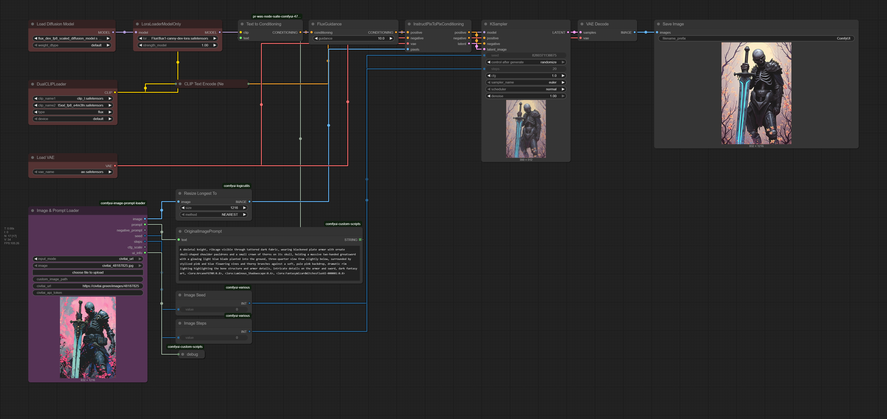

# ComfyUI Image & Prompt Loader

A powerful custom node for ComfyUI that loads images and automatically extracts prompts from multiple sources. Perfect for working with AI-generated images from Civitai, datasets, and local files.


*Screenshot showing the node in action with Civitai image loading*

[Workflow example](examples/hassan-img-prompt-loader-workflow.json)

## Features

- **🌐 Civitai Integration**: Load images directly from Civitai URLs with automatic metadata extraction
- **📁 Local File Support**: Load from local paths or ComfyUI's input folder
- **🔍 Smart Prompt Detection**: Automatically extracts prompts from:
  - Civitai API metadata (primary source for Civitai images)
  - Caption files (.txt files with same name as image)
  - EXIF metadata (from generation parameters)
- **⚙️ Complete Generation Info**: Extracts seed, steps, CFG scale, and other parameters
- **🎨 Dynamic Preview**: Automatically updates node preview when loading Civitai images
- **📚 Dataset Compatible**: Intelligent caption file searching for various dataset structures

## Installation

### Method 1: ComfyUI Manager (Recommended)
1. Install [ComfyUI Manager](https://github.com/ltdrdata/ComfyUI-Manager)
2. Open ComfyUI Manager in your ComfyUI interface
3. Search for "Image & Prompt Loader" 
4. Click Install

### Method 2: Manual Installation
1. Navigate to your ComfyUI custom nodes directory:
   ```bash
   cd ComfyUI/custom_nodes/
   ```
2. Clone this repository:
   ```bash
   git clone https://github.com/hassan-sd/comfyui-image-prompt-loader.git
   ```
3. Install dependencies:
   ```bash
   cd comfyui-image-prompt-loader
   pip install -r requirements.txt
   ```
4. Restart ComfyUI

## Usage

### Basic Setup
1. Add the "Image & Prompt Loader" node to your workflow
2. Choose your input mode:
   - **Local Upload**: Use ComfyUI's standard image upload
   - **Local Path**: Specify a full file path
   - **Civitai URL**: Load directly from Civitai

### Civitai Usage
1. Set input mode to "Civitai URL"
2. Paste a Civitai image URL (e.g., `https://civitai.com/images/123456`)
3. Optionally add your Civitai API token for private images
4. Run the node - it will:
   - Fetch metadata from Civitai API
   - Download and display the image
   - Extract prompt, negative prompt, seed, steps, CFG scale

### Local File Usage
1. Set input mode to "Local Path" 
2. Enter the full path to your image file
3. The node will look for caption files in the same directory
4. Supports common dataset structures and naming conventions

## Node Outputs

The node provides 7 outputs:
- **Image**: The loaded image tensor
- **Prompt**: Extracted positive prompt
- **Negative Prompt**: Extracted negative prompt  
- **Seed**: Generation seed (if available)
- **Steps**: Number of steps (if available)
- **CFG Scale**: CFG scale value (if available)
- **UI Info**: Additional information for debugging

## Example Workflow

*Workflow file will be added here*

## Caption File Support

The node intelligently searches for caption files:
- Same directory as image: `image.txt` or `image.jpg.txt`
- Dataset structures: Searches parent directories for matching folder names
- Supports both plain text and JSON format captions

### Supported Formats

**Plain Text:**
```
beautiful landscape, mountains, sunset, highly detailed
Negative: blurry, low quality, watermark
```

**JSON Format:**
```json
{
  "prompt": "beautiful landscape, mountains, sunset, highly detailed",
  "negative_prompt": "blurry, low quality, watermark"
}
```

## Civitai API

For best results with Civitai:
- Public images work without an API token
- Private images require a Civitai API token
- Get your token from [Civitai API Settings](https://civitai.com/user/account)

## Troubleshooting

**Preview not updating for Civitai images?**
- The node automatically downloads images to ComfyUI's input folder
- The preview should update automatically when processing completes

**Caption files not found?**
- Ensure .txt files have the same base name as your images
- Check that files are in the same directory or supported dataset structure

**Civitai API errors?**
- Verify the URL is a valid Civitai image URL
- For private images, ensure your API token is correct
- Check your internet connection

## Requirements

- ComfyUI
- Python packages: `requests`, `pillow` (automatically installed)

## License

This project is licensed under the Apache License

## Contributing

Contributions are welcome! Please feel free to submit a Pull Request.


